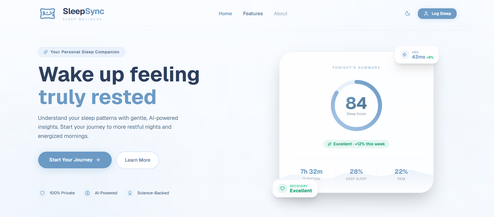
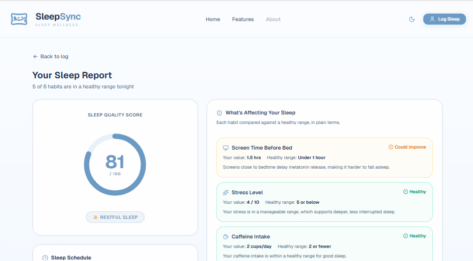

# Predictive Sleep Health Analytics

A web application that analyzes daily sleep habits and predicts sleep quality using a Random Forest machine learning model. Users can log their daily activities, receive a sleep quality score, and view personalized recommendations to improve their sleep patterns.

---

## Features

* Log daily sleep and lifestyle habits
* Predict sleep quality using a Random Forest model
* Calculate age-based recommended sleep duration
* View a detailed analysis of sleep-related factors
* Receive personalized recommendations
* Responsive interface with Light and Dark mode

---

## Tech Stack

**Frontend**

* React.js
* Tailwind CSS
* shadcn/ui
* Lucide React

**Machine Learning**

* Python
* scikit-learn
* Pandas
* NumPy

**Tools**

* Node.js
* npm

---

## Screenshots

## 📸 Screenshots

### Home Page


### Login Page
.png)

### Dashboard


---

## How to Run

### Prerequisites

* Node.js
* Python 3.x

### Install Dependencies

```bash
npm install
```

### Start the Application

```bash
npm run dev
```

Open your browser and visit:

```text
http://localhost:5173
```

---

## Machine Learning Model

The application uses a **Random Forest Classifier** with the following configuration:

* `n_estimators = 200`
* `max_depth = 8`
* `class_weight = "balanced"`
* `random_state = 42`
